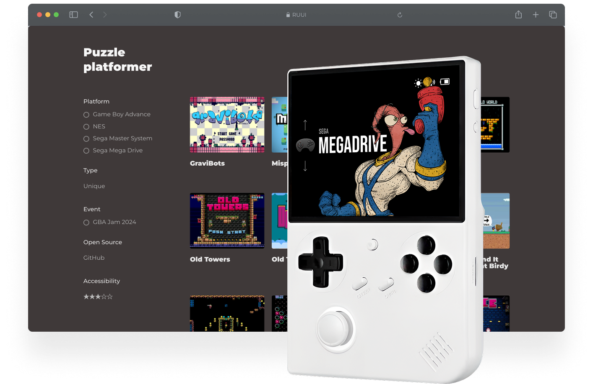

# RUUI

RUUI is a most minimalistic custom launcher for retro handhelds. Now with boxart / art by [Filipe Bello / RetroRama](https://github.com/lipebello/es-theme-retrorama-ce)

RUUI is ready to go project and have a game collection inside. Downlod an archive and drop files to your flash card TF1 in Roms partition. 

You can grab the version for Anbernic devices based on h700 [here](https://drive.google.com/file/d/19q-Em_exBBMY4EulD47aZzsdbgM0PDC3/view?usp=sharing).

  
 

## Features

- Simple launcher, simple SD card
- Hidden settings for emulators
- Boxart for Consoles, Genres and games (you can change it or add covers to .res folders)
- Automatically sleeps after 30 seconds
- Automatically powers off while asleep after two minutes or hold POWER for one second
- Automatically resumes right where you left off if powered off while in-game, manually or while asleep

## Catalog

- You can order folder in any way you like by addind numbers in the beggining of the folders name
- Filder name doesn't shows in a list. UI use cover.png instead placed in .res folder
- You can organize your labruary by Consolse and Genres
- Same Genre folders with different extenshions will be combined in ove
- if you'll have same title name for different consols like .sms and .nes file extention will be shown
- Automatically hides hidden files and extension and region/version cruft in display names
- Resume from manually created, last used save state by pressing X in the launcher instead of A (hidden option)

## Menu

- Consistent in-emulator menu with quick access to save states, disc changing, and emulator options
- Load option goes first, so its easyer to path throught hard game moments not getting saves after death

## Supported consoles

- PlayStation
- TurboGrafx-16 / TurboGrafx-CD
- Sega Genesis
- Super Nintendo Entertainment System
- Nintendo Entertainment System
- Sega Master System
- Sega Game Gear
- Game Boy Advance
- Game Boy Color
- Game Boy
- Pico-8

## Supported Devices

| Device | Status |
| -- | -- |
| Anbernic RG28xx | Not tested |
| Anbernic RG34xx | Not tested |
| Anbernic RG35xx | Tested |
| Anbernic RG35xx Plus | Tested |
| Anbernic RG35xxH | Not tested |
| Anbernic RG35xxSP | Not tested |
| Anbernic RG40xxH | Tested |
| Anbernic RG40xxV | Tested | 
| Anbernic RG CubeXX | Not tested | 

## Links

Official [website](https://yaremko.ru/fahrenheit)

Telegram [channel](https://t.me/tsztsr)

Game collections on [itch.io](https://tsztsr.itch.io/)

Page on [DTF](https://dtf.ru/id2373120)

Global edition [RUUI_Hardcore](https://github.com/lacosta990/Ru_UI/releases/tag/v1.0.0)
