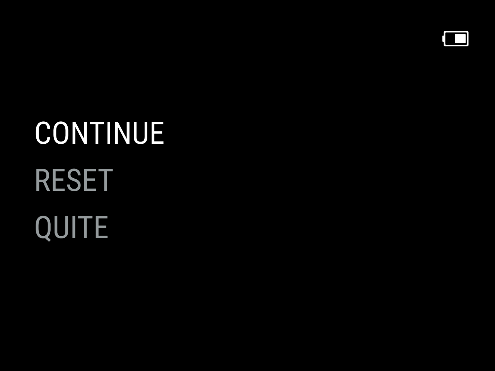

# RUUI Hardcore

RUUI Hardcore is ultra-minimalistic custom launcher that gives clear gameplay how it was meant to be. 
True nastalgia with no cheats with morert savestates that ruines challange. 

   

## Features

- no save or load state
- no settings or configuration
- most minimalistic interface ever

- automatically hides hidden files
  and extension and region/version 
  cruft in display names  
- automatically sleeps after 30 seconds 
  or press POWER to sleep / wake
- powers off while asleep
  after two minutes or hold POWER for
  one second
- resumes right where
  you left off if powered off while
  in-game, manually or while asleep
  
You can [grab the latest version here](https://github.com/shauninman/MinUI/releases).

## Supported consoles

Base:

- Sony PlayStation
- TurboGrafx-16 (and TurboGrafx-CD)
- Sega Genesis
- SNES
- NES
- Game Boy Advance
- Game Boy Color
- Game Boy
- Pico-8

Extras:

- Neo Geo Pocket (and Color)
- Pico-8
- Pokémon mini
- Sega Game Gear
- Sega Master System
- Super Game Boy
- Virtual Boy

## Supported Devices

- Anbernic RG28xx 
- Anbernic RG35xx 
- Anbernic RG35xx Plus
- Anbernic RG35xxH
- Anbernic RG35xxSP
- Anbernic RG40xxH
- Anbernic RG40xxV
- Anbernic RG CubeXX

> [!NOTE]
> **Active** actively working on compatibility and improvements specific to this device  
> **Maintained** inheriting improvements to common functionality  
> **Deprecated** will be retired in a future update  
> **Retired** removed from repo, no longer updated or packaged with new releases  

## Legacy versions

The original Trimui Model S version of MinUI (2021/04/03-2021/08/06) has been archived [here](https://github.com/shauninman/MinUI-Legacy-Trimui-Model-S).

The sequel, MiniUI for the Miyoo Mini (2022/04/20-2022/10/23), has been archived [here](https://github.com/shauninman/MiniUI-Legacy-Miyoo-Mini).

The return of MinUI for the original Anbernic RG35XX (2023/02/26-2023/03/26) has been archived [here](https://github.com/shauninman/MinUI-Legacy-RG35XX).
